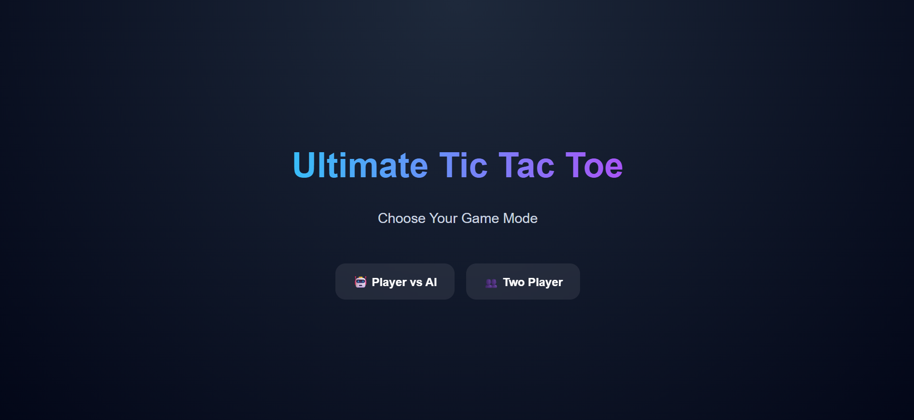
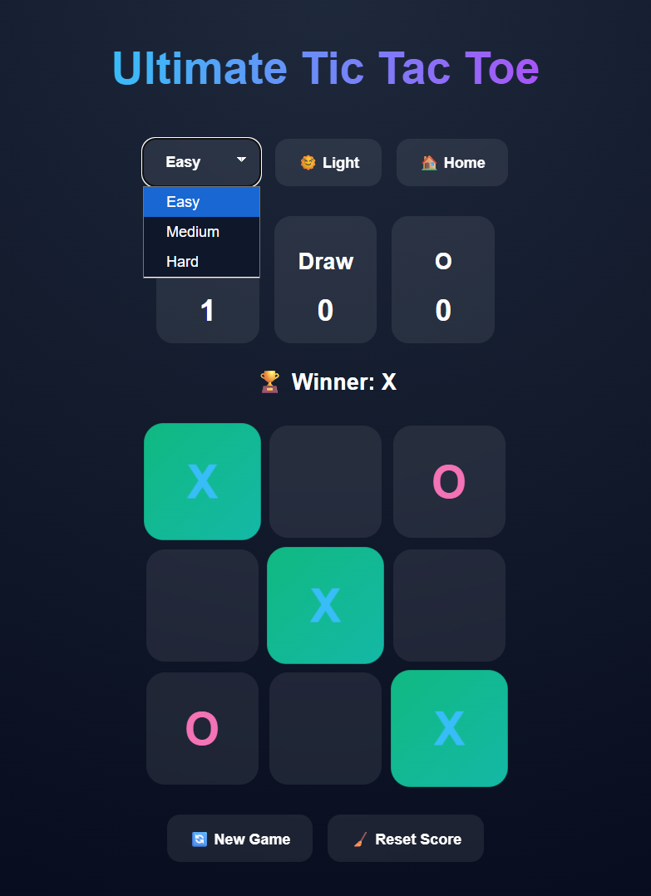
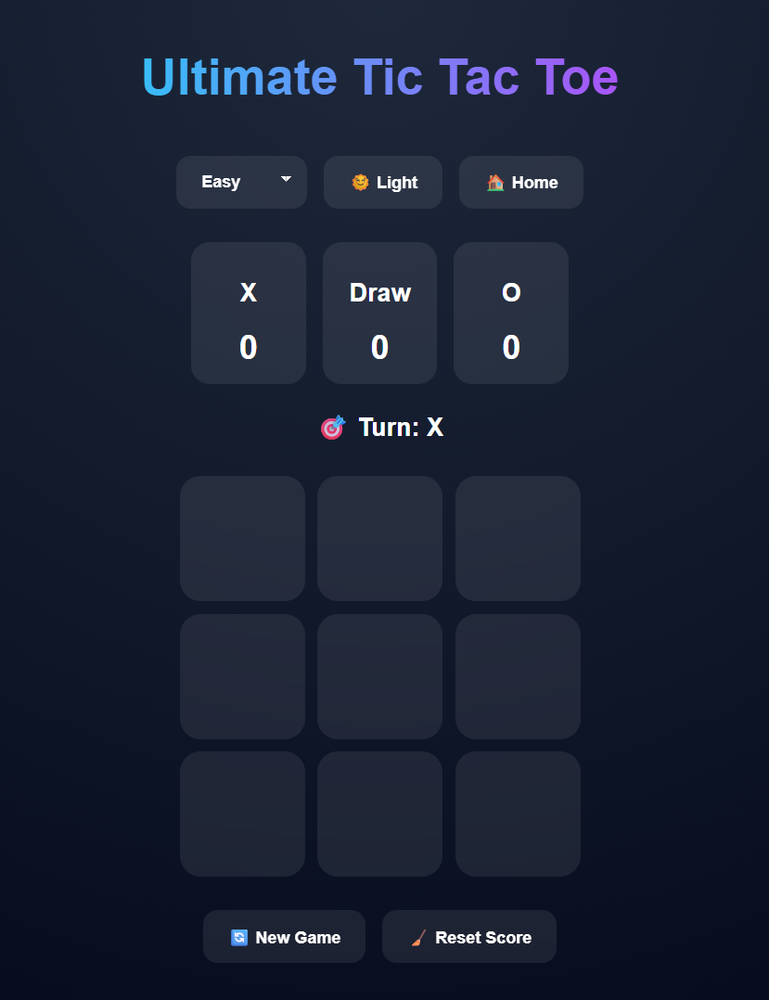
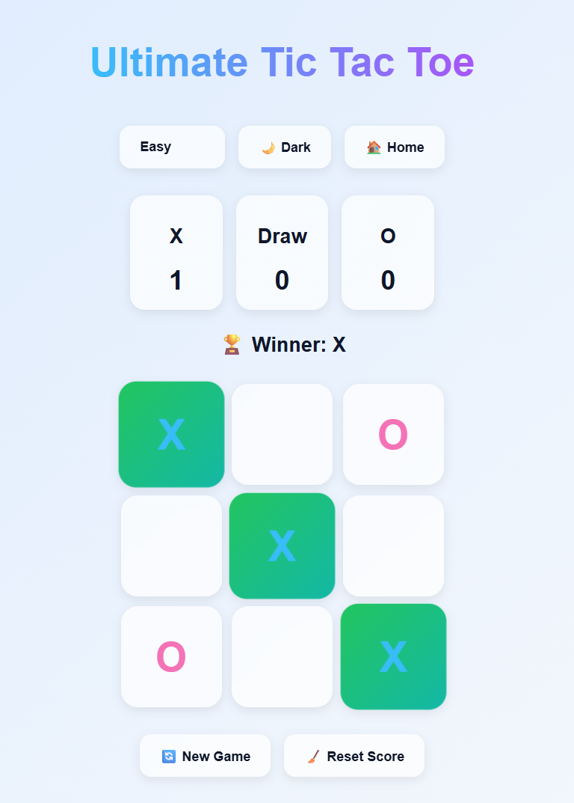

# 🎮 Ultimate Tic-Tac-Toe

<p align="center">  </p> <p align="center">  </p>

Ultimate Tic-Tac-Toe is a modern React-based web game featuring an intelligent AI opponent powered by the Minimax Algorithm, smooth glassmorphism UI, dark/light themes, responsive gameplay, score tracking, and interactive animations for an immersive gaming experience.

---
<p align="center">       </p>

<p align="center">  </p>

# 🖼️ Preview 
## 🎮 Home Screen 
<p align="center"> 
    
</p>

## 🕹️ Gameplay 
<p align="center"> 
    
</p> 

## ☀️Theme
<table>
<tr>
    <td align="center">
      
      <br><b>🌙 Dark Mode</b>
    </td>
    <td align="center">
      
      <br><b>☀️ Light mode</b>
    </td>
  </tr>
</table>


## Features

### Game Modes
- Player vs AI
- Two Player Mode

### Smart AI System
- Easy Mode
- Medium Mode
- Hard Mode (Minimax Algorithm)

### Modern UI
- Glassmorphism design
- Smooth hover animations
- Winner highlight effects
- Responsive layout for mobile & desktop
- Dark / Light mode toggle

### Gameplay Features
- Real-time scoreboard
- Draw detection
- Winning line highlight
- Reset game option
- Reset score option

### Extra Features
- Responsive design for all devices
- Smooth transitions and animations

- Classic 3×3 board with alternating **X** and **O** turns
- Win detection for rows, columns, and diagonals
- Draw detection when the board is full with no winner
- Moves blocked on occupied squares and after the game ends
- One-click reset to play again
- Responsive layout with a dark, modern UI

## 🚀 Tech Stack 
| Technology | Usage | 
|---|---| 
| React.js | Frontend UI | 
| JavaScript | Game Logic | 
| CSS3 | Styling & Animations | 
| Minimax Algorithm | AI Opponent | 
| HTML5 | Structure | 
---

No build step or npm install is required. React and Babel load from a CDN.

## AI Logic

The AI opponent uses the **Minimax Algorithm**, that 
- Analyze all possible moves
- Predict outcomes 
- Make optimal decisions
- Become unbeatable in hard mode

Difficulty Levels:

- Easy → Random moves
- Medium → Mixed random + optimal moves
- Hard → Perfect AI using Minimax

## Responsive Design

The game is fully optimized for:

- Mobile Devices
- Laptops
-  Desktop Screens
- Tablets

## Installation

### Prerequisites

- A modern web browser (Chrome, Firefox, Edge, Safari)
- Internet access (for CDN scripts on first load)

### Run locally

1. Clone the repository:
   ```bash
   git clone https://github.com/ayushracherlawar-ai/tic-tac-toe.git
   cd tic-tac-toe/Tic-Tac-Toe\ Game
   ```
2. Open `index.html` in your browser (double-click the file or use Live Server in VS Code).

### GitHub Pages (optional)

If this folder is the site root, enable **GitHub Pages** in the repo settings and set the source to the branch/folder that contains `index.html`. Visit:

`https://ayushracherlawar-ai.github.io/tic-tac-toe/`

## How to Play

1. **X** always goes first.
2. Click an empty square to place your mark.
3. Players alternate until one wins or the board is full.
4. The status bar shows the winner, a draw, or whose turn is next.
5. Click **New game** to clear the board and start again.
6. Match 3 symbols in a row to win
7. Play against AI or your friend
8. Reset and replay anytime

## Project Structure

```
Tic-Tac-Toe Game/
├── assets/
├── index.html    # Entry point, loads React and mounts Board
├── index.jsx     # Board component and game logic
├── styles.css    # Layout and visual design
└── README.md     # Project documentation
```

## Implementation Notes

- **`Board`** is exported as a named component and holds all game state.
- The board is an array of 9 cells; winning lines are checked with a shared `calculateWinner` helper.
- Squares are `<button class="square">` elements inside a CSS Grid container for a 3×3 layout.
- Reset is handled by `<button onClick={resetGame}>`, which clears squares and restores **X** as the first player.

## Learning Goals

This project practices:

- React functional components and hooks
- Immutable state updates (`slice`, spread)
- Conditional rendering for game status
- Event handling and input validation in UI games

## 🌟 Upcoming Features
- 🔥 Neon Theme
- 🏅 Achievement System
- 📜 Move History
- ⏪ Undo Move
- 🎵 Sound Effects
- 🌐 Online Multiplayer
- 🧩 4x4 & 5x5 Boards
- 📊 Game Statistics Dashboard


## 🤝 Contributing

Contributions are welcome!

1. Fork the project
2. Create your feature branch
3. Commit your changes
4. Push to the branch
5. Open a Pull Request
## 👨‍💻 Author

Developed by **Ayush Racherlawar**

> © 2026 Ultimate Tic-Tac-Toe Game. All Rights Reserved.

## 📄 License

This project is licensed under the [MIT License](LICENSE).

# ⭐ Support

If you liked this project:
- Star the repository ⭐
- Fork the project 🍴
- 🧠 Share feedback
- 🚀 Build your own version

### “Simple game. Smart AI. Clean UI. Endless fun.” 🎯
---